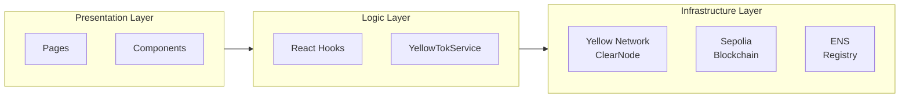
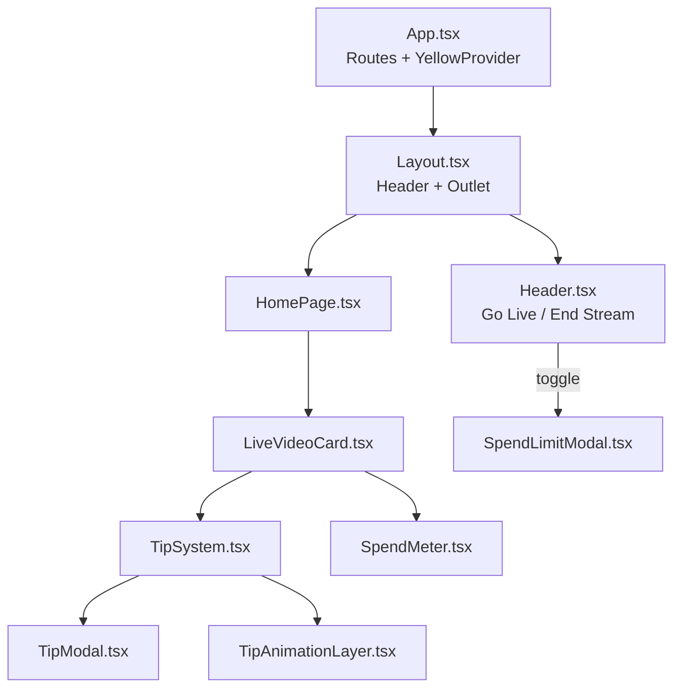
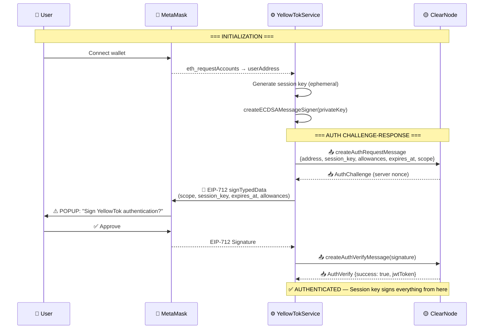
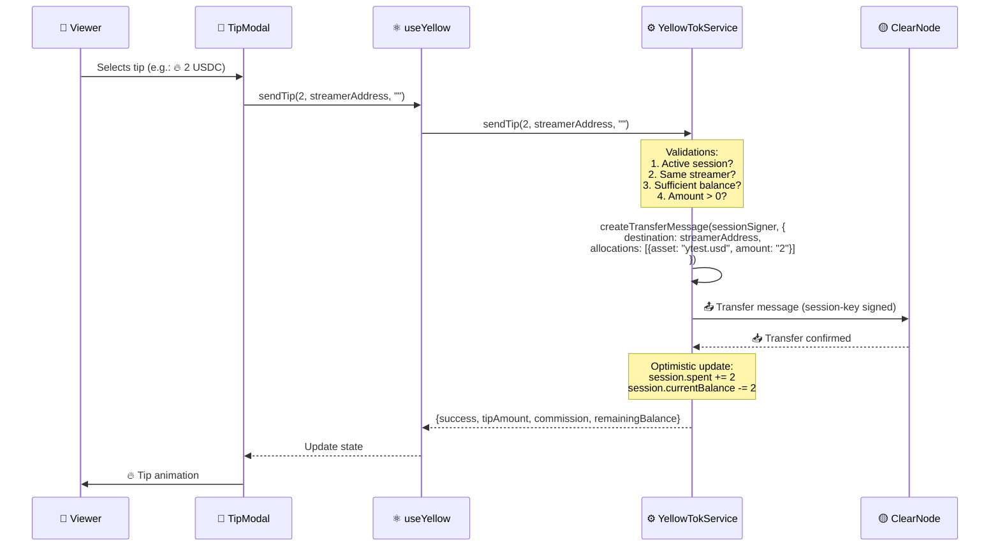
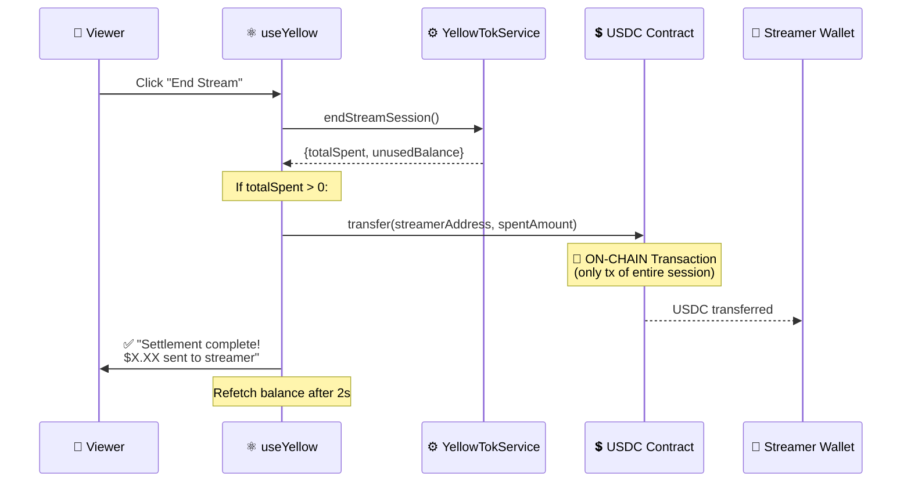
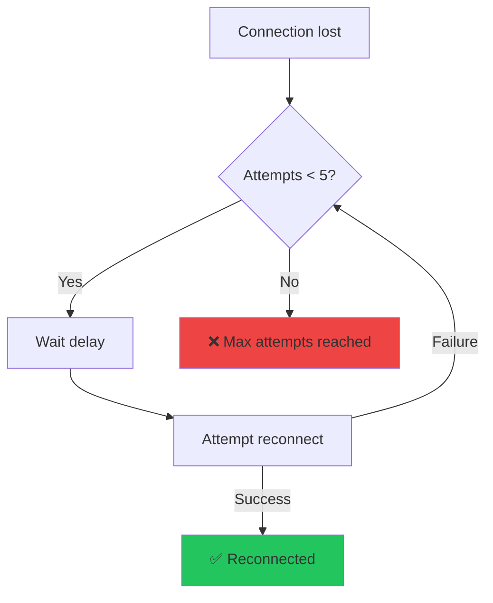
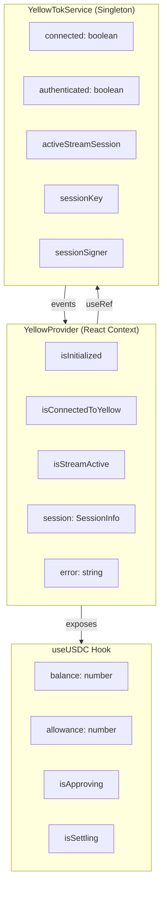

# 🏗️ YellowTok — Technical Architecture

> Detailed technical documentation of the system, data flows, Yellow Network integration, and design decisions.

---

## 📋 Table of Contents

1. [System Overview](#system-overview)
2. [Component Architecture](#component-architecture)
3. [Authentication Flow](#authentication-flow)
4. [Tipping Flow](#tipping-flow)
5. [Settlement Flow](#settlement-flow)
6. [Yellow Network Integration](#yellow-network-integration)
7. [ENS Integration](#ens-integration)
8. [State Management](#state-management)
9. [Network Configuration](#network-configuration)
10. [Security](#security)
11. [Testing](#testing)
12. [Troubleshooting](#troubleshooting)

---

## 1. System Overview

YellowTok is a **live streaming dApp with instant tipping** built on Yellow Network. The architecture is divided into three layers:



### Design Principles

- **Zero-gas tipping**: All tips are off-chain transfers; only the final settlement touches the blockchain.
- **Single popup UX**: EIP-712 authentication is the only interaction requiring manual approval.
- **Session key signing**: After authentication, an ephemeral key signs all operations.
- **Optimistic updates**: The UI updates immediately; ClearNode confirmation arrives asynchronously.

---

## 2. Component Architecture

### 2.1 Pages

```
src/pages/
├── LandingPage.tsx   → Marketing page with 3D hero (Three.js)
├── HomePage.tsx      → TikTok-style feed with LiveVideoCard
└── StreamerPage.tsx  → Streamer ENS profile
```

| Page | Route | Responsibility |
|--------|------|-----------------|
| `LandingPage` | `/` | Hero section, features, CTA. 3D background with `@react-three/fiber` (particle network). |
| `HomePage` | `/home` | Streaming feed. Displays a `LiveVideoCard` with the streamer configured via env. |
| `StreamerPage` | `/streamer/:ensName` | Resolves ENS name → address, displays avatar, description, Twitter, URL, email. |

### 2.2 Core Components

```
src/components/
├── Header.tsx             → Top bar: logo, nav, Go Live toggle, USDC balance
├── Layout.tsx             → Wrapper with Header + react-router Outlet
├── ConnectButton.tsx      → MetaMask connection button
├── LiveVideoCard.tsx      → Video card with interaction overlay
├── TipSystem.tsx          → Orchestrator: TipModal + TipAnimationLayer
├── TipModal.tsx           → Tip options grid (6 emoji levels)
├── TipAnimationLayer.tsx  → Floating emoji animations (framer-motion)
├── SpendLimitModal.tsx    → Session budget configuration
└── SpendMeter.tsx         → Progress bar: spent vs. limit
```

### 2.3 Tip Options

Defined in `TipModal.tsx`:

| Emoji | Name | Price | Color Gradient |
|-------|--------|--------|----------------|
| ❤️ | Heart | 1 USDC | red → pink |
| 🔥 | Fire | 2 USDC | orange → red |
| ⭐ | Star | 5 USDC | yellow → orange |
| 💎 | Diamond | 10 USDC | cyan → blue |
| 🚀 | Rocket | 20 USDC | purple → pink |
| 👑 | Crown | 50 USDC | yellow → amber |

### 2.4 Component Relationships



---

## 3. Authentication Flow

Authentication uses the Nitrolite SDK's **EIP-712 challenge-response** protocol. It's the **only step requiring a wallet popup**.



### Session Details

| Parameter | Value | Description |
|-----------|-------|-------------|
| `scope` | `yellowtok.app` | Session scope |
| `appName` | `YellowTok` | Application name |
| `sessionDuration` | 3600s (1h) | Session duration |
| `allowances` | `[{asset: "ytest.usd", amount: "10000"}]` | Maximum budget |
| `defaultAsset` | `ytest.usd` | Sandbox asset |

### Session Key Management

Session keys are persisted in `localStorage` with a **configuration fingerprint**:

```javascript
// If config changes (asset, scope, app), the session key is regenerated
const configFingerprint = JSON.stringify({
  asset: this.config.defaultAsset,
  scope: this.config.authScope,
  app: this.config.appName,
});
```

This ensures that if the configuration changes (e.g., from sandbox to production), a new session key is generated so ClearNode registers the new allowances.

---

## 4. Tipping Flow

Tips are **off-chain transfers** signed with the session key. **$0 gas**, **no popups**, **instant**.



### Commission Calculation

```
commissionAmount = tipAmount × (commissionRate / 100)
creatorReceives  = tipAmount - commissionAmount
```

| Type | Rate | Example ($10 tip) |
|------|------|--------------------|
| Standard | 10% | Streamer receives $9.00 |
| Partner | 3% | Streamer receives $9.70 |

---

## 5. Settlement Flow

Settlement occurs when the user clicks **"End Stream"**. It's the **only on-chain transaction** of the entire session.



### Economic Model

```
┌────────────────────────────────────────────┐
│            STREAMING SESSION                │
├────────────────────────────────────────────┤
│                                            │
│  Initial budget: $10.00 USDC               │
│                                            │
│  Tips sent (off-chain):                    │
│    ❤️  $1.00                                │
│    🔥  $2.00                                │
│    ⭐  $5.00                                │
│    ─────────                               │
│    Total spent: $8.00                      │
│    Unused: $2.00                           │
│                                            │
│  On-chain settlement:                      │
│    → Streamer receives: $8.00 USDC (1 tx)  │
│    → Viewer keeps: $2.00 USDC              │
│                                            │
│  Total gas paid: ~0.0001 ETH (only 1 tx)   │
│                                            │
└────────────────────────────────────────────┘
```

---

## 6. Yellow Network Integration

### 6.1 SDK Imports

```javascript
import {
  createAuthRequestMessage,    // Step 1: Start authentication
  createAuthVerifyMessage,     // Step 4: Send EIP-712 signature
  createEIP712AuthMessageSigner, // Create EIP-712 signer for auth
  createECDSAMessageSigner,   // Create ECDSA signer for session key
  createTransferMessage,       // Send off-chain tip
  createGetLedgerBalancesMessage, // Query balance in ClearNode
  parseAnyRPCResponse,         // ClearNode response parser
  RPCMethod,                   // RPC method enums
} from '@erc7824/nitrolite';
```

### 6.2 Handled RPC Methods

| RPCMethod | Direction | Description |
|-----------|-----------|-------------|
| `AuthChallenge` | ← ClearNode | Challenge recibido, firma necesaria |
| `AuthVerify` | ← ClearNode | Auth exitosa, JWT recibido |
| `Transfer` | ← ClearNode | Confirmación de transferencia |
| `BalanceUpdate` | ← ClearNode | Push de actualización de balance |
| `GetLedgerBalances` | ← ClearNode | Respuesta a consulta de balance |
| `ChannelsUpdate` | ← ClearNode | Actualización de canales |
| `Assets` | ← ClearNode | Info de assets disponibles |
| `Error` | ← ClearNode | Error del ClearNode |

### 6.3 WebSocket Connection

```
URL: wss://clearnet-sandbox.yellow.com/ws
Protocol: JSON-RPC over WebSocket
Reconnection: Exponential backoff (1s → 2s → 4s → ... → 30s max)
Max attempts: 5
```

### 6.4 Reconnection Flow



Delay = `min(1000 × 2^attempt, 30000)` ms

---

## 7. ENS Integration

ENS is used to resolve the streamer's identity. Uses native wagmi hooks.

### Resolved ENS Data

| Hook wagmi | Key | Usage |
|------------|-----|-----|
| `useEnsName` | — | Resolve address → ENS name |
| `useEnsAddress` | — | Resolve ENS name → address |
| `useEnsAvatar` | — | Profile avatar |
| `useEnsText` | `description` | Biography |
| `useEnsText` | `com.twitter` | Twitter/X handle |
| `useEnsText` | `url` | Personal website |
| `useEnsText` | `email` | Contact email |

### Bidirectional Resolution

`StreamerPage` supports both ENS names and direct addresses:

```typescript
// If the parameter is a 0x... address
const isAddressParam = ensName && isAddress(ensName)

// If it's an ENS name → resolve to address
const { data: resolvedAddress } = useEnsAddress({
  name: !isAddressParam ? normalize(ensName) : undefined,
  chainId: ENS_CHAIN_ID, // sepolia
})
```

---

## 8. State Management

### 8.1 State Architecture



### 8.2 YellowProvider — Exposed Methods

| Method | Description | Gas |
|--------|-------------|-----|
| `initialize()` | Connect wallet + ClearNode + auth | Free (1 popup) |
| `createSession(streamer, amount)` | Create local streaming session | Free |
| `sendTip(amount, streamer, msg)` | Off-chain tip via createTransferMessage | **$0 gas** |
| `endSession()` | Close local session | Free |
| `toggleStream(streamer, amount)` | Go Live / End Stream with settlement | 1 on-chain tx |
| `approveUSDC(amount)` | Approve USDC to custody | 1 on-chain tx |
| `checkSpendingLimit(tip, limit)` | Verify if tip exceeds limit | Free |

### 8.3 Event System

`YellowTokService` emits events that `YellowProvider` listens to:

```javascript
service.on('onConnected', () => setIsConnectedToYellow(true))
service.on('onDisconnected', () => setIsConnectedToYellow(false))
service.on('onSessionCreated', () => setSession(service.getSessionInfo()))
service.on('onTipSent', () => setSession(service.getSessionInfo()))
service.on('onBalanceUpdate', () => setSession(service.getSessionInfo()))
service.on('onSessionClosed', () => setSession(null))
service.on('onError', (evt) => setError(evt.message))
```

---

## 9. Network Configuration

### 9.1 Blockchain

| Parámetro | Valor |
| Parameter | Value |
|-----------|-------|
| **Network** | Sepolia Testnet |
| **Chain ID** | 11155111 |
| **USDC Address** | `0x1c7D4B196Cb0C7B01d743Fbc6116a902379C7238` |
| **Custody Address** | `0xb3173d618e51277372B473e02E8ab05e97A3626c` |
| **USDC Decimals** | 6 |

### 9.2 Yellow Network

| Parameter | Value |
|-----------|-------|
| **ClearNode URL** | `wss://clearnet-sandbox.yellow.com/ws` |
| **Environment** | Sandbox (testing) |
| **Asset** | `ytest.usd` |
| **Asset Decimals** | 6 |

### 9.3 wagmi Configuration

```typescript
// wagmi.ts
import { sepolia } from 'wagmi/chains'

const config = createConfig({
  chains: [sepolia],
  connectors: [injected()],  // MetaMask
  transports: { [sepolia.id]: http() },
})
```

---

## 10. Security

### 10.1 Session Key Isolation

- The session key is **ephemeral** — generated per session and stored in `localStorage`.
- If the configuration fingerprint changes, the previous key is **automatically invalidated**.
- The key is NEVER sent to the server; only **messages signed** by it are sent.

### 10.2 Spending Limits

- The user configures a **spending limit** per session (via `SpendLimitModal`).
- Each tip is validated against the session's remaining balance.
- Warning when reaching 90% of the limit.

### 10.3 Auth Timeout

- Authentication has a **30-second timeout**.
- If the connection is lost during auth, it cleanly cancels.
- Temporary event listeners are removed in all paths (success, failure, timeout).

### 10.4 WebSocket Security

- WSS connection (TLS encrypted).
- Automatic reconnection with exponential backoff.
- Maximum 5 reconnection attempts.

### 10.5 Contracts

- USDC on Sepolia (testnet) — no real funds at risk.
- Settlement only transfers the **exact amount spent** (not the complete budget).
- The custody address is configurable via `contracts.ts`.

---

## 11. Testing

### 11.1 Service Tests

```bash
# Run service unit tests
node backend/YellowTokService.test.js
```

The `YellowTokService.test.js` file tests:

- ✅ Service initialization with default configuration
- ✅ Custom configuration
- ✅ Session creation
- ✅ Tip sending with validations
- ✅ Commission calculation (standard and partner)
- ✅ Spending limits control
- ✅ Event handlers
- ✅ Unit conversion (dollars ↔ asset units)

### 11.2 Manual Testing

1. Connect MetaMask to Sepolia
2. Get testnet USDC from a faucet
3. Click "Go Live" → approve EIP-712 signature
4. Send tips of different amounts
5. Click "End Stream" → verify on-chain settlement

---

## 12. Troubleshooting

### Common Issues

| Problem | Cause | Solution |
|----------|-------|----------|
| "Wallet not connected" | MetaMask not connected or on wrong network | Connect MetaMask to Sepolia |
| "Authentication timed out" | ClearNode doesn't respond within 30s | Verify ClearNode URL, retry |
| "User rejected signature" | User cancelled EIP-712 signature | Retry "Go Live" |
| "Insufficient balance" | Insufficient USDC for budget | Get more testnet USDC |
| "No active stream session" | Attempting tip without active session | Click "Go Live" first |
| Session key mismatch | Config changed but old key persists | Delete `yellowtok_session_key` from localStorage |
| WebSocket disconnect | Unstable connection | Service auto-reconnects (5 attempts) |

### Clear Local State

```javascript
// In browser console:
localStorage.removeItem('yellowtok_session_key')
localStorage.removeItem('yellowtok_jwt')
localStorage.removeItem('yellowtok_spend_limit')
```

### Verify ClearNode Connection

```javascript
// In browser console:
const ws = new WebSocket('wss://clearnet-sandbox.yellow.com/ws')
ws.onopen = () => console.log('✅ ClearNode accessible')
ws.onerror = (e) => console.error('❌ ClearNode inaccessible:', e)
```

---

<div align="center">

📖 See also: [README.md](README.md) · [pdr.md](pdr.md) · [context.md](context.md)

</div>
