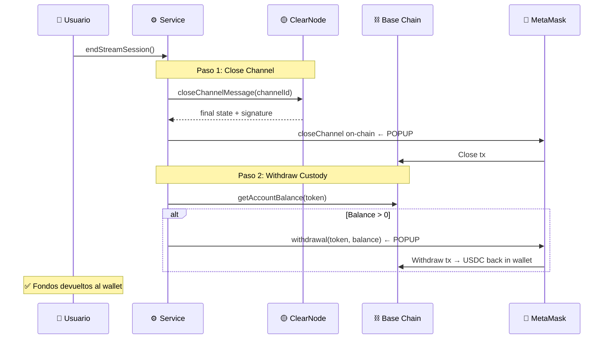

# 🚀 Production Branch: `feat/production-websocket-base-usdc`

> **Migración completa de Sandbox/Sepolia a Producción/Base Mainnet con flujo real de State Channels.**

[](https://base.org)
[](https://yellow.org)
[](https://www.circle.com/en/usdc)

---

## 📋 Tabla de Contenidos

1. [Resumen del Branch](#1-resumen-del-branch)
2. [Cambios de Red y Configuración](#2-cambios-de-red-y-configuración)
3. [Flujo Completo de State Channels](#3-flujo-completo-de-state-channels)
4. [Nuevos Métodos del Servicio](#4-nuevos-métodos-del-servicio)
5. [Cambios en el Hook useYellow](#5-cambios-en-el-hook-useyellow)
6. [Cambios en la UI](#6-cambios-en-la-ui)
7. [Nuevos Eventos](#7-nuevos-eventos)
8. [Variables de Entorno](#8-variables-de-entorno)
9. [Diferencias main vs. Production](#9-diferencias-main-vs-production)
10. [Archivos Modificados](#10-archivos-modificados)
11. [Riesgos y Consideraciones](#11-riesgos-y-consideraciones)

---

## 1. Resumen del Branch

Este branch transforma YellowTok de un **demo en sandbox** a una **aplicación de producción** que opera con **USDC real en Base mainnet** a través del ClearNode de producción de Yellow Network.

### Cambios Clave

| Aspecto | `main` (Sandbox) | `feat/production-websocket-base-usdc` |
|---------|:-----------------:|:-------------------------------------:|
| **Red blockchain** | Sepolia testnet | **Base mainnet** |
| **ClearNode** | `wss://clearnet-sandbox.yellow.com/ws` | `wss://clearnet.yellow.com/ws` |
| **Asset** | `ytest.usd` (test) | `usdc` (real) |
| **USDC Address** | `0x1c7D...7238` (Sepolia) | `0x8335...2913` (Base) |
| **Custody Address** | `0xb317...626c` (streamer) | `0x490f...38b6` (Yellow Network) |
| **Fondos** | Testnet (sin valor) | **USDC real ($)** |
| **State Channels** | ❌ No implementados | ✅ Flujo completo de 7 pasos |
| **On-chain ops** | Solo transfer simple | Approve → Deposit → Channel → Resize → Allocate → Close → Withdraw |
| **Keep-alive** | ❌ No | ✅ Ping cada 25s |
| **Deep Cleanup** | ❌ No | ✅ Cierre de canales huérfanos + drain de custody |

---

## 2. Cambios de Red y Configuración

### 2.1 `chains.ts` — Dual-chain Setup

```typescript
// ANTES (main): Solo Sepolia
import { sepolia } from 'wagmi/chains'
export const PRIMARY_CHAIN = sepolia

// DESPUÉS (production): Base mainnet + Sepolia para ENS
import { sepolia, base } from 'wagmi/chains'
export const ENS_CHAIN = sepolia       // ENS resolution stays on Sepolia
export const USDC_CHAIN = base         // USDC transactions on Base mainnet
export const PRIMARY_CHAIN = base      // Wallet connects to Base
```

### 2.2 `contracts.ts` — Direcciones de Producción

| Contrato | Sandbox (main) | Producción |
|----------|:--------------:|:----------:|
| USDC Token | `0x1c7D4B196Cb0C7B01d743Fbc6116a902379C7238` | `0x833589fCD6eDb6E08f4c7C32D4f71b54bdA02913` |
| Custody | `0xb3173d618e51277372B473e02E8ab05e97A3626c` | `0x490fb189DdE3a01B00be9BA5F41e3447FbC838b6` |

### 2.3 `wagmi.ts` — Multi-chain + Alchemy RPC

```typescript
// Production: Base (Alchemy RPC) + Sepolia (public, solo ENS)
const BASE_RPC_URL = import.meta.env.VITE_ACCHEMY_RPC_BASE_URL

export const config = createConfig({
  chains: [PRIMARY_CHAIN, ENS_CHAIN],  // [base, sepolia]
  transports: {
    [PRIMARY_CHAIN.id]: http(BASE_RPC_URL),  // Alchemy para Base
    [ENS_CHAIN.id]: http(),                  // Public RPC para ENS
  },
})
```

---

## 3. Flujo Completo de State Channels

La diferencia fundamental es que **main** solo envía transferencias off-chain sin respaldo on-chain real, mientras que **production** implementa el flujo completo de Yellow Network:

```mermaid
sequenceDiagram
    participant U as 👤 Usuario
    participant W as 🦊 MetaMask
    participant S as ⚙️ Service
    participant CN as 🟡 ClearNode
    participant BC as ⛓️ Base Chain

    Note over U,BC: === DEPOSIT FLOW (7 pasos) ===

    rect rgb(50, 50, 50)
        Note over S: Pre-check: Cerrar canales stale + drenar custody
        S->>CN: closeChannel (si existe canal previo)
        S->>BC: closeChannel on-chain
        S->>BC: withdrawal de custody sobrante
    end

    rect rgb(30, 60, 30)
        Note over S,BC: Paso 1: Setup NitroliteClient
        S->>S: new NitroliteClient({walletClient, publicClient, addresses})
    end

    rect rgb(30, 60, 30)
        Note over S,BC: Paso 2: Approve USDC → Custody
        S->>BC: USDC.allowance(user, custody)
        alt Allowance insuficiente
            S->>W: approve(custody, amount) ← POPUP
            W->>BC: Approve tx
        end
    end

    rect rgb(30, 60, 30)
        Note over S,BC: Paso 3: Deposit USDC → Custody (on-chain)
        S->>W: deposit(token, amount) ← POPUP
        W->>BC: Deposit tx → "Available Balance"
    end

    rect rgb(30, 30, 60)
        Note over S,CN: Paso 4: Create State Channel (WS + on-chain)
        S->>CN: createCreateChannelMessage
        CN-->>S: channel params + server signature
        S->>W: createChannel on-chain ← POPUP
        W->>BC: Channel creation tx
        S->>S: _waitForChannelReady (ClearNode ChannelsUpdate)
    end

    rect rgb(60, 30, 30)
        Note over S,CN: Paso 5: Resize — Custody → Channel
        S->>CN: createResizeChannelMessage(resize_amount)
        CN-->>S: resize state + signature
        S->>W: resizeChannel on-chain ← POPUP
        W->>BC: Resize tx → "Channel-Locked"
        S->>S: _waitForResizeProcessed
    end

    rect rgb(60, 30, 60)
        Note over S,CN: Paso 6: Allocate — Channel → Unified Balance
        S->>CN: createResizeChannelMessage(allocate_amount)
        CN-->>S: allocate state + signature
        S->>W: resizeChannel on-chain ← POPUP
        W->>BC: Allocate tx → "Unified Balance"
    end

    rect rgb(30, 60, 60)
        Note over S,CN: Paso 7: Confirmar fondos en Unified Balance
        S->>CN: getLedgerBalances (poll cada 10s)
        CN-->>S: balance > 0 ✅
    end

    Note over U,BC: ✅ LISTO — Tips off-chain habilitados ($0 gas)
```



### Flujo de Cierre (End Stream)



---

## 4. Nuevos Métodos del Servicio

### `YellowTokService.js` — Métodos Agregados (~870 líneas nuevas)

| Método | Tipo | Descripción |
|--------|------|-------------|
| `_sendRPC(message, method, timeout)` | Private | Helper para RPC request-response con timeout |
| `_getConfig()` | Private | Obtener config del ClearNode (networks, broker) |
| `getSupportedChainIds()` | Public | Lista de chain IDs soportados |
| `isChainSupported(chainId)` | Public | Verificar si una chain es soportada |
| `getUSDCTokenForChain(chainId)` | Public | Obtener token address USDC por chain |
| `_findNetworkForChain(chainId)` | Private | Buscar config de red (custody, adjudicator) |
| `_closeStaleChannel(id, chain, custody, adjudicator)` | Private | Cerrar canal huérfano + withdraw |
| `_waitForChannelReady(channelId, timeout)` | Private | Esperar confirmación de canal del ClearNode |
| `_waitForResizeProcessed(channelId, timeout)` | Private | Esperar confirmación de resize |
| `_waitForDepositConfirmed(amount, timeout)` | Private | Esperar balance > 0 con polling cada 10s |
| `deepCleanup(chainId, tokenAddress)` | Public | Limpieza completa: cerrar todos los canales + drenar custody |
| `depositAndOpenChannel(amount, chainId, token)` | Public | **Flujo completo de 7 pasos** (core del branch) |
| `closeChannelAndWithdraw()` | Public | Cerrar canal + retirar fondos de custody |
| `_startKeepAlive()` | Private | Ping cada 25s para evitar idle timeout |
| `_stopKeepAlive()` | Private | Detener keep-alive |

### Nuevos Imports del SDK

```javascript
// Nuevos en production:
import {
  createGetConfigMessage,        // Obtener config del ClearNode
  createCreateChannelMessage,    // Crear state channel
  createCloseChannelMessage,     // Cerrar channel
  createResizeChannelMessage,    // Resize + Allocate
  NitroliteClient,               // Cliente on-chain (deposit, close, withdraw)
  WalletStateSigner,             // Signer para operaciones on-chain
} from '@erc7824/nitrolite';

import { parseUnits, formatUnits } from 'viem';  // Para manejar decimales
```

### Nuevo Estado Interno

```javascript
// Nuevas propiedades del servicio:
this._pendingRequests = new Map();    // RPC request-response tracking
this.brokerAddress = null;            // Dirección del broker del ClearNode
this.networkConfig = null;            // Config de redes soportadas
this.channelId = null;                // Canal activo
this._existingChannelId = null;       // Canal detectado de sesión anterior
this.nitroliteClient = null;          // NitroliteClient para ops on-chain
this.publicClient = null;             // viem PublicClient
this.tokenAddress = null;             // USDC token address
this.assets = [];                     // Lista de assets del ClearNode
this.isDeposited = false;             // Flag de depósito confirmado
this._keepAliveInterval = null;       // Intervalo de ping
```

---

## 5. Cambios en el Hook `useYellow`

### Nuevos estados expuestos

| Estado | Tipo | Descripción |
|--------|------|-------------|
| `isDepositingToYellow` | `boolean` | Depósito de USDC en progreso |
| `isWithdrawingFromYellow` | `boolean` | Retiro de fondos en progreso |
| `depositStep` | `string \| null` | Descripción del paso actual de depósito/retiro |
| `isCleaning` | `boolean` | Limpieza profunda en progreso |

### Nuevos métodos expuestos

| Método | Descripción |
|--------|-------------|
| `cleanupYellow()` | Deep cleanup: cerrar canales huérfanos, drenar custody, resetear estado |

### Cambios en `initialize()`

```typescript
// ANTES (main): Usa window.ethereum
const result = await service.initialize(window.ethereum, walletClient)

// DESPUÉS (production): Usa address + publicClient directamente
const result = await service.initialize(address, walletClient, publicClient)
```

### Cambios en `toggleStream()` — Go Live

**Antes (main):** Simplemente crea una sesión local y envía tips. Al hacer "End Stream", transfiere USDC directamente al streamer on-chain.

**Después (production):**
1. Verifica balance USDC en Base
2. Cambia MetaMask a Base mainnet (`switchChainAsync`)
3. Llama `depositAndOpenChannel()` — flujo de 7 pasos con ~4-5 popups de MetaMask
4. Crea sesión local
5. Al hacer "End Stream", llama `closeChannelAndWithdraw()` en lugar de transfer directo

---

## 6. Cambios en la UI

### `Header.tsx` — Botón de Cleanup + Deposit Step

- **Nuevo botón 🧹 Cleanup**: Visible junto al toggle de stream. Ejecuta `deepCleanup()` para cerrar canales huérfanos.
- **Spending limit default**: Cambiado de `$10` a `$0.5` (fondos reales, montos pequeños).
- **`depositStep`**: Se muestra como estado durante operaciones largas.

### `TipModal.tsx` — Montos Ajustados para Producción

| Emoji | Sandbox (main) | Producción |
|-------|:--------------:|:----------:|
| ✨ Spark | — | **$0.001** (nuevo) |
| ❤️ Heart | $1 | **$0.01** |
| 🔥 Fire | $2 | **$0.1** |
| ⭐ Star | $5 | **$1** |
| 💎 Diamond | $10 | **$5** |
| 🚀 Rocket | $20 | ❌ Eliminado |
| 👑 Crown | $50 | **$10** |

### `SpendLimitModal.tsx` — Presets Reducidos

| Sandbox (main) | Producción |
|:--------------:|:----------:|
| $10, $25, $50, $100, $250 | **$0.1, $0.5, $1, $5, $10** |
| Default: $10 | Default: **$0.5** |

### `useUSDC.ts` — Lecturas de Base Mainnet

Todas las lecturas de balance/allowance y escrituras (approve, transfer) ahora apuntan a `USDC_BASE_ADDRESS` en `USDC_CHAIN_ID` (Base 8453).

---

## 7. Nuevos Eventos

| Evento | Payload | Cuándo se dispara |
|--------|---------|-------------------|
| `onAuthenticated` | `void` | Auth EIP-712 completada |
| `onConfigReady` | `{networks, brokerAddress}` | Config del ClearNode recibida |
| `onDepositProgress` | `{step, total, message, complete?}` | Cada paso del depósito (1-7) |
| `onWithdrawProgress` | `{step, total, message, complete?}` | Cada paso del retiro (1-2) |

---

## 8. Variables de Entorno

```env
# Producción — nuevas o modificadas
VITE_STREAMER_ADDRESS=0x...            # Dirección del streamer (sin cambio)
VITE_NITROLITE_WS_URL=wss://clearnet.yellow.com/ws   # ClearNode producción
VITE_ACCHEMY_RPC_BASE_URL=https://base-mainnet.g.alchemy.com/v2/YOUR_KEY  # Alchemy RPC para Base
```

---

## 9. Diferencias main vs. Production

### Flujo de "Go Live" (comparación)

```
┌─────────────────────────────────┬─────────────────────────────────────────────┐
│      main (Sandbox)             │   production (Base Mainnet)                 │
├─────────────────────────────────┼─────────────────────────────────────────────┤
│                                 │                                             │
│  1. Connect wallet              │  1. Connect wallet                          │
│  2. Auth EIP-712 (1 popup)      │  2. Auth EIP-712 (1 popup)                  │
│  3. Create local session        │  3. Fetch ClearNode config                  │
│  4. Send tips (off-chain)       │  4. Switch MetaMask to Base                 │
│  5. End Stream                  │  5. Close stale channels (0-2 popups)       │
│  6. Transfer USDC to streamer   │  6. Approve USDC → custody (1 popup)        │
│     (1 tx on-chain)             │  7. Deposit USDC → custody (1 popup)        │
│                                 │  8. Create channel on-chain (1 popup)       │
│  Total popups: 2                │  9. Resize: custody → channel (1 popup)     │
│  Total on-chain tx: 1           │  10. Allocate: channel → unified (1 popup)  │
│                                 │  11. Wait for balance confirmation          │
│                                 │  12. Create local session                   │
│                                 │  13. Send tips (off-chain, $0 gas)          │
│                                 │  14. End Stream                             │
│                                 │  15. Close channel on-chain (1 popup)       │
│                                 │  16. Withdraw from custody (1 popup)        │
│                                 │                                             │
│                                 │  Total popups: ~6-8                         │
│                                 │  Total on-chain tx: ~5-7                    │
│                                 │                                             │
└─────────────────────────────────┴─────────────────────────────────────────────┘
```

### Resumen de Trade-offs

| Aspecto | Sandbox | Producción |
|---------|---------|------------|
| **Complejidad** | Simple (auth + transfer) | Compleja (7-step deposit + 2-step withdraw) |
| **Popups de wallet** | 2 | 6-8 |
| **Gas total** | ~$0.001 (1 tx Sepolia) | ~$1-5 (5-7 tx Base) |
| **Fondos** | Test tokens (sin valor) | **USDC real** |
| **Seguridad on-chain** | Ninguna (transfer directo) | Custody contract + Adjudicator |
| **Tips off-chain** | Firmados pero sin respaldo | **Respaldados por state channel** |
| **Cleanup** | No necesario | Esencial (canales huérfanos) |
| **Keep-alive** | No | Sí (ping cada 25s) |

---

## 10. Archivos Modificados

| Archivo | Líneas cambiadas | Tipo de cambio |
|---------|:----------------:|----------------|
| `src/services/YellowTokService.js` | +1132 | Core: deposit flow, channels, cleanup, keep-alive |
| `src/hooks/useYellow.tsx` | +233 ~-150 | Deposit/withdraw states, cleanup, multi-chain |
| `src/services/YellowTokService.d.ts` | +52 | Nuevos tipos para channel ops y eventos |
| `src/components/TipModal.tsx` | +38 ~-20 | Montos ajustados, nuevo ✨ Spark |
| `src/components/Header.tsx` | +35 | Botón Cleanup, depositStep display |
| `src/config/contracts.ts` | +17 ~-10 | Direcciones Base mainnet |
| `src/hooks/useUSDC.ts` | +15 ~-10 | Base chain ID para reads/writes |
| `src/config/chains.ts` | +13 ~-3 | Dual-chain (Base + Sepolia) |
| `src/wagmi.ts` | +10 ~-5 | Alchemy RPC, multi-chain config |
| `src/components/SpendLimitModal.tsx` | +4 ~-4 | Presets reducidos |
| `src/services/YellowTokService.test.js` | +2 ~-2 | Asset name update |
| `src/nitrolite-documentation.md` | +4597 | Documentación interna del SDK |

---

## 11. Riesgos y Consideraciones

### ⚠️ Fondos Reales

Esta rama opera con **USDC real en Base mainnet**. Cualquier bug en el flujo de deposit/channel/withdraw puede resultar en **pérdida de fondos**.

### ⚠️ Canales Huérfanos

Si el usuario cierra el navegador durante el flujo de 7 pasos, puede quedar un canal abierto con fondos bloqueados. El botón **🧹 Cleanup** y el método `deepCleanup()` existen para resolver este caso.

### ⚠️ Múltiples Popups de MetaMask

El flujo de deposit requiere ~4-5 aprobaciones de MetaMask consecutivas. Esto es significativamente peor UX que sandbox (1 popup). Es una limitación inherente del flujo actual de state channels que requiere operaciones on-chain secuenciales.

### ⚠️ Gas en Base

Cada operación on-chain consume gas en Base (ETH). El usuario necesita tener ETH en Base además de USDC.

### ⚠️ Variable de Entorno con Typo

La variable `VITE_ACCHEMY_RPC_BASE_URL` tiene un typo (`ACCHEMY` en lugar de `ALCHEMY`). Se mantiene así por compatibilidad con la rama.

---

<div align="center">

📖 Ver también: [README.md](README.md) · [ARCHITECTURE.md](ARCHITECTURE.md) · [pdr.md](pdr.md)

**Branch**: `feat/production-websocket-base-usdc` — YellowTok Production Mode

</div>
