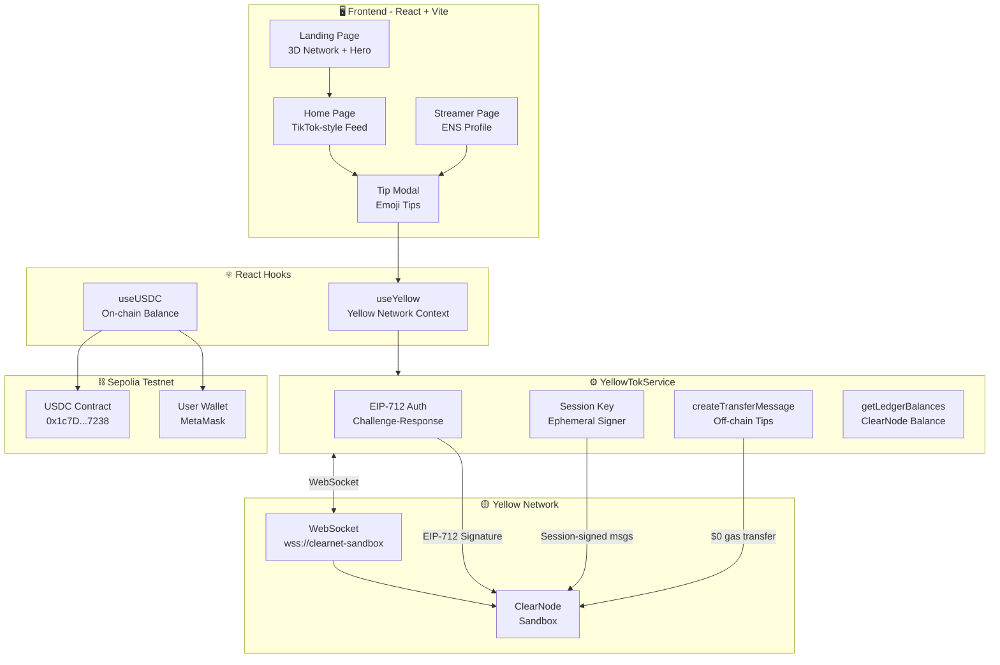

# 🟡 YellowTok

> **Instant tipping for live streaming — no gas, no pop-ups, zero friction.**

[](https://yellow.org)
[](https://www.npmjs.com/package/@erc7824/nitrolite)
[](https://react.dev)
[](https://vitejs.dev)
[](https://tailwindcss.com)
[](LICENSE)

---

## 🎯 The Problem

Current live streaming platforms charge creators **up to 70% in commissions**. Payments take **weeks** to settle, and every transaction requires expensive on-chain confirmations. Viewers get frustrated with wallets that ask them to approve every single micro-transaction.

## 💡 The Solution

**YellowTok** reimagines streaming tips using **Yellow Network** and the **ERC-7824 (State Channels)** standard:

- ⚡ **Instant tips**: Off-chain transfers signed with session keys — **$0 gas per tip**
- 🔑 **One-time popup**: EIP-712 authentication once, then zero interruptions
- 💰 **Fair commissions**: Only 3-10% vs. 50-70% from centralized platforms
- 🎭 **ENS Identity**: Streamers identified by their ENS name, avatar, and records

---

## 🚀 Quick Start

### Prerequisites

- **Node.js** v18+
- **MetaMask** or another Sepolia-compatible wallet
- Test funds on **Sepolia** (ETH for gas + testnet USDC)
- **🔑 ENS Name Required**: The streamer address **MUST have an ENS name** (`.eth`) registered for the app to display profile information (name, avatar, bio, links). You can register ENS names at [app.ens.domains](https://app.ens.domains)

### Installation

```bash
# Clone the repository
git clone https://github.com/your-username/yellow-tok.git
cd yellow-tok

# Install dependencies
npm install

# Configure environment variables
cp .env.example .env
```

### Environment Variables

```env
# Streamer's wallet address (MUST have ENS name registered!)
VITE_STREAMER_ADDRESS=0xb3173d618e51277372B473e02E8ab05e97A3626c

# ClearNode URL (sandbox by default)
VITE_NITROLITE_WS_URL=wss://clearnet-sandbox.yellow.com/ws
```

### Run in Development

```bash
npm run dev
```

The application will be available at `http://localhost:5173`

---

## 📚 Documentation

This project includes comprehensive documentation to help you understand and work with YellowTok:

- **[ARCHITECTURE.md](ARCHITECTURE.md)** - Technical architecture, component details, sequence diagrams, and Yellow Network integration
- **[pdr.md](pdr.md)** - Product Definition Report with features, roadmap, and business model
- **[PRODUCTION-BRANCH.md](PRODUCTION-BRANCH.md)** - Documentation for the production branch (`feat/production-websocket-base-usdc`) with Base mainnet integration and full state channel flow

---

## 🏗️ Architecture



---

## 🟡 Yellow Network Products Used

| Product | Use in YellowTok | Description |
|----------|------------------|-------------|
| **Nitrolite SDK** | Payment core | TypeScript SDK for state channels (ERC-7824) |
| **ClearNode** | Off-chain intermediary | Node that processes transfers with no gas |
| **EIP-712 Auth** | Authentication | Challenge-response to establish secure session |
| **Session Keys** | Frictionless UX | Ephemeral keys that sign without wallet popups |
| **createTransferMessage** | Instant tips | Off-chain transfers signed by session key |
| **parseAnyRPCResponse** | Communication | Parser for ClearNode RPC messages |

---

## ✨ Features

### Implemented ✅

| Feature | Description | Status |
|---------|-------------|--------|
| 🔌 Wallet Connection | MetaMask on Sepolia testnet | ✅ Complete |
| 🔐 Auth EIP-712 | Challenge-response with ClearNode | ✅ Complete |
| 🔑 Session Keys | Ephemeral keys for signing without popups | ✅ Complete |
| 💸 Off-chain Tips | createTransferMessage at $0 gas | ✅ Complete |
| 🎭 ENS Profiles | Avatar, name, description, Twitter, URL | ✅ Complete |
| 📺 TikTok-style Feed | Full-screen video card with overlay | ✅ Complete |
| 💰 USDC Balance | Real-time on-chain reading | ✅ Complete |
| 🎛️ Spending Limit | Budget control per session | ✅ Complete |
| 🎬 Toggle Stream | Go Live / End Stream with settlement | ✅ Complete |
| 🌐 Landing Page | 3D hero with Three.js particles | ✅ Complete |
| 🎨 UI YellowTok | Dark theme + primary yellow (#FACC15) | ✅ Complete |
| 💫 Tip Animations | Emoji animations with framer-motion | ✅ Complete |

### Roadmap 🗺️

| Feature | Description | Priority |
|---------|-------------|----------|
| 📡 WebRTC Streaming | Real peer-to-peer live video | High |
| 💬 Live Chat | Messages during stream | High |
| 🏦 Automatic Settlement | On-chain settlement on session close | Medium |
| 🎯 Multi-streamer | Feed with multiple streamers | Medium |
| 📊 Dashboard Analytics | Metrics for streamers | Low |
| 🏆 Leaderboard | Top tippers per streamer | Low |
| 🔔 Notifications | Push notifications for tips | Low |

## 📁 Project Structure

```
yellow-tok/
├── src/
│   ├── App.tsx                    # Main router
│   ├── main.tsx                   # Entry point
│   ├── wagmi.ts                   # wagmi configuration (Sepolia)
│   ├── index.css                  # Global styles + Tailwind
│   ├── components/
│   │   ├── ConnectButton.tsx      # MetaMask connection button
│   │   ├── Header.tsx             # Header with Go Live + USDC balance
│   │   ├── Layout.tsx             # Layout wrapper with Header
│   │   ├── LiveVideoCard.tsx      # TikTok-style video card
│   │   ├── SpendLimitModal.tsx    # Modal to configure spending limit
│   │   ├── SpendMeter.tsx         # Spending progress bar
│   │   ├── TipAnimationLayer.tsx  # Tip animations layer
│   │   ├── TipModal.tsx           # Modal with tip options (❤️🔥⭐💎🚀👑)
│   │   └── TipSystem.tsx          # Tip system orchestrator
│   ├── config/
│   │   ├── chains.ts              # Sepolia configuration
│   │   └── contracts.ts           # USDC + Custody addresses + ABI
│   ├── hooks/
│   │   ├── useYellow.tsx          # Context + Yellow Network hook
│   │   └── useUSDC.ts             # Hook for USDC balance/approve on-chain
│   ├── pages/
│   │   ├── HomePage.tsx           # Main feed with LiveVideoCard
│   │   ├── LandingPage.tsx        # 3D landing with Three.js
│   │   └── StreamerPage.tsx       # Streamer profile with ENS data
│   └── services/
│       ├── YellowTokService.js    # Core: auth + off-chain tips
│       ├── YellowTokService.d.ts  # TypeScript definitions
│       └── YellowTokService.test.js # Unit tests
├── context.md                     # Product definition
├── AGENTS.MD                      # Instructions for AI agents
├── ARCHITECTURE.md                # Detailed technical documentation
├── pdr.md                         # Product Definition Report
├── package.json
├── tsconfig.json
├── vite.config.ts
└── index.html
```

---

## 🔧 Tech Stack

| Layer | Technology | Version |
|-------|------------|---------|  
| **Framework** | React | 19+ |
| **Build** | Vite | 6+ |
| **Language** | TypeScript | 5+ |
| **Styling** | Tailwind CSS | 4 |
| **Animations** | Framer Motion | 12 |
| **3D** | Three.js + @react-three/fiber | 0.182 |
| **Web3** | wagmi + viem | latest |
| **Routing** | React Router DOM | 7 |
| **Icons** | Lucide React | 0.563 |
| **Yellow Network** | @erc7824/nitrolite | 0.5.3 |
| **Network** | Sepolia Testnet | — |

---

## 🎨 Color Palette

| Color | Hex | Usage |
|-------|-----|-------|
| 🟡 Primary | `#FACC15` | Buttons, accents, logo |
| ⬛ Background | `#0A0A0A` | Main background |
| 🔲 Surface | `#141414` | Cards, modals |
| 🔳 Surface Light | `#1F1F1F` | Borders, dividers |
| 🌟 Accent | `#FDE047` | Hover, highlights |
| ⬜ Text | `#FFFFFF` | Primary text |
| 🩶 Text Secondary | `#A1A1AA` | Secondary text |

---

## 🤝 Contributing

1. Fork the repository
2. Create your feature branch (`git checkout -b feature/amazing-feature`)
3. Commit your changes (`git commit -m 'feat: add amazing feature'`)
4. Push to the branch (`git push origin feature/amazing-feature`)
5. Open a Pull Request

---

## 📄 License

This project is under the MIT License — see the [LICENSE](LICENSE) file for more details.

---

<div align="center">

**Built with 💛 for [Hack the Money](https://hackthemoney.xyz) hackathon**

Powered by [Yellow Network](https://yellow.org) · [ERC-7824](https://eips.ethereum.org/EIPS/eip-7824) · [Nitrolite SDK](https://www.npmjs.com/package/@erc7824/nitrolite)

</div>
